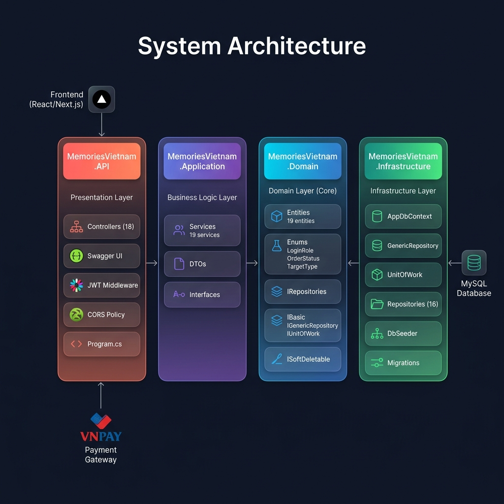
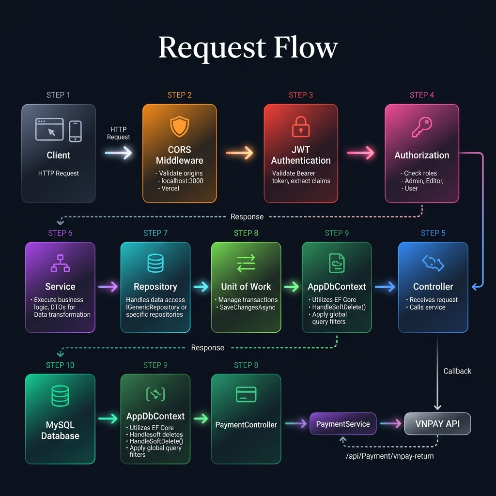
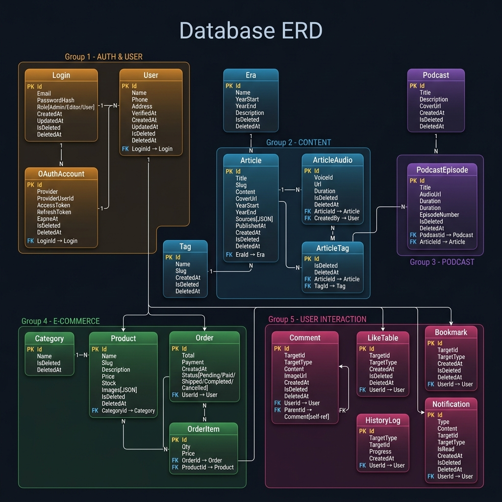
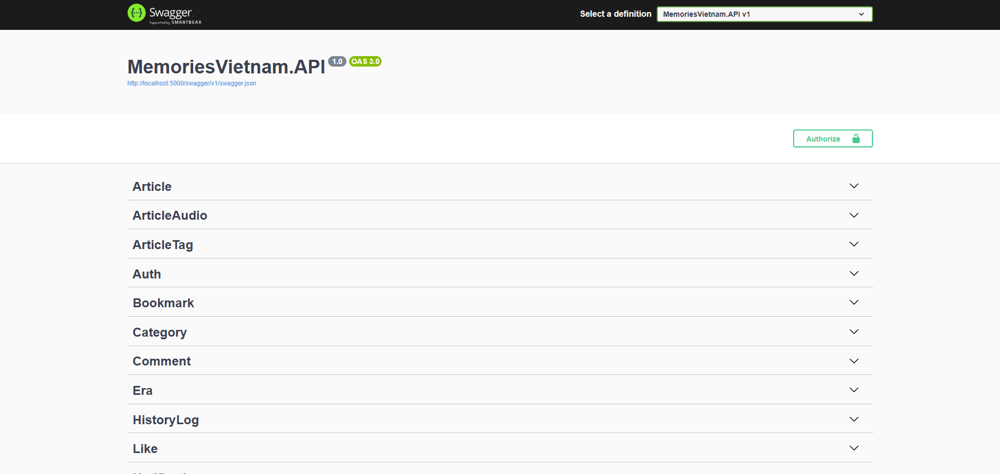

# 🇻🇳 Memories Vietnam - Backend

<p align="center">
  RESTful Backend API for a historical knowledge platform integrated with e-commerce.
</p>

<p align="center">


</p>

---

# 📖 Overview

**Memories Vietnam** is a RESTful backend API powering a historical learning platform combined with an e-commerce system.

The system enables users to explore Vietnamese history through articles, podcasts, and audio content while supporting community interaction and online purchases of history-related products.

This project was developed using **ASP.NET Core Web API (.NET 8)** following a layered architecture with Entity Framework Core, Repository Pattern, and JWT Authentication.

---

# ✨ Project Highlights

- 🚀 Designed and implemented **109+ RESTful APIs**
- 🗄️ Designed a relational database with **19 tables**
- 🔐 JWT Authentication & Role-based Authorization
- 💳 Integrated VNPAY Sandbox Payment
- 🎧 Audio & Podcast Management
- ❤️ Community Interaction System
- 🏛️ Layered Architecture
- 📦 Repository Pattern + Unit of Work
- 📄 Swagger API Documentation

---

# 🏗️ System Architecture

<p align="center">

</p>

The backend follows a layered architecture to separate business logic, data access, and infrastructure, improving maintainability and scalability.

---

# 🔄 Request Flow

<p align="center">

</p>

A typical request passes through Middleware, Authentication, Controllers, Services, Repository Layer, Entity Framework Core, and finally reaches the MySQL database before returning the response.

---

# 🗄️ Database Design

The system contains **19 relational tables** supporting authentication, historical content, podcasts, user interaction, e-commerce, and payment modules.

<p align="center">

</p>

---

# 📡 API Documentation

Swagger is provided for testing and exploring every REST endpoint.

<p align="center">

</p>

---

# 📚 Main Features

## 🔐 Authentication

- User Registration
- Login
- OAuth Login
- JWT Authentication
- Role-based Authorization
- Password Hashing (BCrypt)

---

## 📖 Historical Content

- Historical Eras
- Articles
- Tags
- Reference Sources
- Article Filtering
- Rich Content Support

---

## 🎧 Audio & Podcast

- Article Audio
- Podcast Management
- Podcast Episodes

---

## 👥 Community

- Likes
- Bookmarks
- Nested Comments
- Reading History
- Notifications

---

## 🛒 E-Commerce

- Product Management
- Categories
- Orders
- Order Details
- Inventory Management
- VNPAY Payment Integration

---

# 📂 Solution Structure

```text
MemoriesVietnam

├── MemoriesVietnam.API
│
├── MemoriesVietnam.Application
│
├── MemoriesVietnam.Domain
│
└── MemoriesVietnam.Infrastructure
```

| Project | Responsibility |
|----------|----------------|
| API | Controllers, Middleware, Swagger, Dependency Injection |
| Application | Business Logic, DTOs, Services |
| Domain | Entities, Interfaces, Contracts |
| Infrastructure | EF Core, Repositories, Database, Migrations |

---

# 🛠️ Technology Stack

### Backend

- ASP.NET Core Web API (.NET 8)
- Entity Framework Core
- MySQL

### Authentication

- JWT Bearer Token
- BCrypt

### Payment

- VNPAY Sandbox

### Documentation

- Swagger / OpenAPI

### Development Tools

- Visual Studio 2022
- Postman
- Git & GitHub

---

# 🚀 Getting Started

## Prerequisites

- .NET 8 SDK
- MySQL
- Visual Studio 2022 / Rider / VS Code

---

## Clone Repository

```bash
git clone https://github.com/YOUR_USERNAME/MemoriesVietnam.git
```

---

## Restore Packages

```bash
dotnet restore
```

---

## Configure

Update the following configuration before running:

- Connection String
- JWT Settings
- Admin Account
- VNPAY Configuration

---

## Run

```bash
dotnet run --project MemoriesVietnam.API
```

Swagger:

```
https://localhost:<port>/swagger
```

---

# 📌 Future Improvements

- Docker Support
- Redis Cache
- Background Jobs
- Unit Testing
- CI/CD Pipeline
- Monitoring & Logging

---

# 👨‍💻 Author

**Hien Dam**

Backend .NET Developer

GitHub:
https://github.com/HienDamHai

---

⭐ If you found this project interesting, consider giving it a star.
